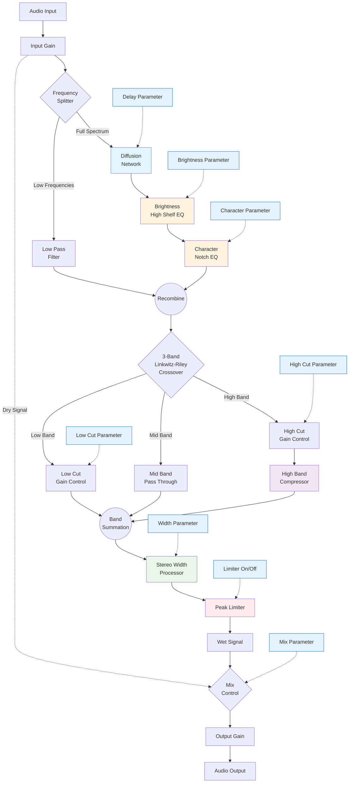

# Plugin Implementation Plan

## Project Overview

**Plugin Name:** Chasm  
**Version:** 1.0.0  
**Framework:** JUCE with CMake
**Architecture:** Modular DSP with parallel processing paths  
**Target Formats:** VST3, AU, AAX

---

## 1. Architecture Overview

### Signal Flow Diagram

### Core Processing Modules

1. **Input Stage** - Gain control and signal splitting
2. **Frequency Splitter** - Low frequency preservation
3. **Diffusion Network** - Main reverb/smear effect
4. **EQ Section** - Brightness and character controls
5. **Multiband Processor** - 3-band Linkwitz-Riley with compression
6. **Output Stage** - Stereo enhancement, limiting, and mixing

---

## 2. Module Specifications

### 2.1 Input Stage

**Responsibility:** Initial gain staging and signal routing  
**Components:**

- Input gain parameter (-24dB to +24dB)
- Signal splitter for parallel paths
- Metering for input levels

**Implementation Notes:**

- [ ] Define crossover frequency for low preservation (suggest 200-500Hz)
- [ ] Implement smooth parameter changes to avoid clicks
- [ ] Consider mono/stereo input handling

### 2.2 Low Frequency Preservation Path

**Responsibility:** Preserve low frequency content from diffusion  
**Components:**

- Linkwitz-Riley lowpass filter
- Gain compensation stage
- Phase alignment consideration

**Implementation Notes:**

- [ ] Match phase response with diffusion path
- [ ] Variable crossover frequency vs fixed
- [ ] Latency compensation if needed

### 2.3 Diffusion Network

**Responsibility:** Create the signature "chasm" smeared sound  
**Components:**

- Allpass filter chains (4-8 stages)
- Feedback matrix (FDN structure)
- Delay time modulation
- Diffusion density control

**Parameters:**

- Delay (controls diffusion time/size)

**Implementation Notes:**

- [ ] Choose between Schroeder allpass chains vs FDN
- [ ] Define delay time ranges (1-100ms suggested)
- [ ] Implement modulation for movement
- [ ] Consider CPU optimization strategies

### 2.4 EQ Section

**Responsibility:** Tonal shaping of diffused signal  
**Components:**

- High shelf filter (Brightness)
- Parametric notch filter (Character)
- Gain staging between filters

**Parameters:**

- Brightness (frequency: 2-10kHz, gain: -12 to +12dB)
- Character (Q factor control for notch resonance)

**Implementation Notes:**

- [ ] Define notch frequency behavior (fixed vs variable)
- [ ] Link notch gain to brightness parameter
- [ ] Use stable filter implementations (SVF or ZDF)

### 2.5 Multiband Processor

**Responsibility:** Frequency-dependent dynamics control  
**Components:**

- 3-band Linkwitz-Riley crossover (24dB/oct)
- Per-band gain controls
- High-band compressor
- Band summing stage

**Parameters:**

- Low Cut (gain reduction for low band)
- High Cut (gain reduction for high band)
- Crossover frequencies (internal or exposed?)

**Implementation Notes:**

- [ ] Define crossover frequencies (e.g., 250Hz, 2.5kHz)
- [ ] Implement phase-coherent crossover
- [ ] Design compressor for high band (ratio, attack, release)
- [ ] Consider make-up gain strategies

### 2.6 Output Stage

**Responsibility:** Final signal conditioning and mixing  
**Components:**

- Stereo width processor
- Peak limiter
- Dry/wet mixer
- Output gain

**Parameters:**

- Width (0-200%)
- Limiter enabled (on/off)
- Mix (0-100%)
- Output gain (-24dB to +24dB)

**Implementation Notes:**

- [ ] Choose stereo widening algorithm (M/S, Haas, etc.)
- [ ] Implement lookahead limiter vs simple clipper
- [ ] Equal-power crossfade for mix control
- [ ] Consider true bypass option

---

## 3. Parameter Management

### Parameter List with Specifications

| Parameter   | Range         | Default | Scaling     | Smoothing |
| ----------- | ------------- | ------- | ----------- | --------- |
| Input Gain  | -24 to +24 dB | 0 dB    | Linear      | 5ms       |
| Output Gain | -24 to +24 dB | 0 dB    | Linear      | 5ms       |
| Mix         | 0 to 100%     | 50%     | Linear      | 20ms      |
| Delay       | 1 to 100ms    | 30ms    | Logarithmic | 50ms      |
| Brightness  | -12 to +12 dB | 0 dB    | Linear      | 10ms      |
| Character   | 0.1 to 10 (Q) | 1.0     | Logarithmic | 10ms      |
| Low Cut     | 0 to 100%     | 0%      | Linear      | 20ms      |
| High Cut    | 0 to 100%     | 0%      | Linear      | 20ms      |
| Width       | 0 to 200%     | 100%    | Linear      | 20ms      |
| Limiter     | On/Off        | On      | Binary      | N/A       |

### Parameter Implementation Strategy

- [ ] Create parameter ID enum
- [ ] Implement AudioProcessorValueTreeState
- [ ] Design parameter listeners for UI updates
- [ ] Create parameter preset system
- [ ] Implement parameter automation

---

## 4. Development Phases

### Phase 1: Project Setup and Core Infrastructure

**Duration:** 1 week  
**Deliverables:**

- [ ] CMake project structure
- [ ] Basic JUCE plugin scaffold
- [ ] Parameter management system
- [ ] Basic UI framework
- [ ] Unit test framework setup

**Success Criteria:**

- Plugin loads in DAW
- Parameters visible and automatable
- Basic audio passthrough working

### Phase 2: Basic Signal Path

**Duration:** 1 week  
**Deliverables:**

- [ ] Input/output gain stages
- [ ] Dry/wet mixing
- [ ] Basic metering
- [ ] Signal splitting infrastructure

**Success Criteria:**

- Clean gain control without artifacts
- Proper mix control with equal-power crossfade
- No clicks or pops during parameter changes

### Phase 3: Diffusion Network Implementation

**Duration:** 2 weeks  
**Deliverables:**

- [ ] Allpass filter chain implementation
- [ ] Feedback network design
- [ ] Delay parameter control
- [ ] CPU optimization

**Success Criteria:**

- Smooth, artifact-free diffusion
- Stable feedback behavior
- CPU usage under 10% for typical use

### Phase 4: Frequency Processing

**Duration:** 1.5 weeks  
**Deliverables:**

- [ ] Low frequency preservation path
- [ ] Brightness and Character EQ
- [ ] Phase alignment verification

**Success Criteria:**

- No phase cancellation issues
- Smooth filter parameter changes
- Musical EQ response

### Phase 5: Multiband Processing

**Duration:** 2 weeks  
**Deliverables:**

- [ ] Linkwitz-Riley crossover implementation
- [ ] Per-band gain controls
- [ ] High-band compressor
- [ ] Band recombination

**Success Criteria:**

- Phase-coherent crossover
- Transparent compression
- No audible artifacts at crossover points

### Phase 6: Output Processing

**Duration:** 1 week  
**Deliverables:**

- [ ] Stereo width processor
- [ ] Peak limiter
- [ ] Final output stage

**Success Criteria:**

- Natural stereo enhancement
- Transparent limiting
- No output clipping

### Phase 7: UI Implementation

**Duration:** 2 weeks  
**Deliverables:**

- [ ] Complete UI design implementation
- [ ] Parameter visualization
- [ ] Metering displays
- [ ] Preset management UI

**Success Criteria:**

- Responsive, lag-free UI
- Clear visual feedback
- Intuitive user experience

### Phase 8: Testing and Optimization

**Duration:** 1.5 weeks  
**Deliverables:**

- [ ] Comprehensive test suite
- [ ] Performance profiling
- [ ] Bug fixes
- [ ] Documentation

**Success Criteria:**

- All unit tests passing
- No memory leaks
- CPU usage optimized
- Stable in all target DAWs

---

## 5. Technical Considerations

### DSP Design Decisions

**Filter Topology**

- [ ] Choose between IIR vs FIR for EQ section
- [ ] Implement zero-delay feedback filters if needed
- [ ] Consider oversampling for nonlinear processing

**Diffusion Algorithm**

- [ ] Evaluate Schroeder vs FDN vs novel approaches
- [ ] Determine optimal diffusion density
- [ ] Balance quality vs CPU usage

**Latency Management**

- [ ] Calculate total plugin latency
- [ ] Report latency to host
- [ ] Implement latency compensation if needed

### Performance Optimization

**Memory Management**

- [ ] Pre-allocate all buffers
- [ ] Avoid dynamic allocation in process block
- [ ] Use aligned memory for SIMD

**CPU Optimization**

- [ ] Profile hot paths
- [ ] Implement SIMD where beneficial
- [ ] Consider multi-threading for independent paths

**Real-time Safety**

- [ ] No blocking calls in audio thread
- [ ] Lock-free parameter updates
- [ ] Efficient buffer management

---

## 6. Testing Strategy

### Unit Testing

- [ ] DSP module isolation tests
- [ ] Parameter range validation
- [ ] Filter stability tests
- [ ] Phase coherence verification

### Integration Testing

- [ ] Full signal path validation
- [ ] Automation testing
- [ ] Preset recall accuracy
- [ ] Multi-instance behavior

### Performance Testing

- [ ] CPU usage benchmarks
- [ ] Memory usage profiling
- [ ] Latency measurements
- [ ] Stress testing (max parameters)

### Compatibility Testing

- [ ] VST3 validation
- [ ] AU validation
- [ ] AAX validation
- [ ] DAW compatibility matrix

---

## 7. Quality Assurance Checklist

### Audio Quality

- [ ] No clicks or pops
- [ ] No DC offset
- [ ] Proper gain staging
- [ ] Phase coherent processing
- [ ] No aliasing artifacts

### User Experience

- [ ] Responsive parameter changes
- [ ] Smooth UI updates
- [ ] Intuitive parameter ranges
- [ ] Clear visual feedback
- [ ] Helpful parameter names

### Technical Requirements

- [ ] Sample rate independence
- [ ] Bit depth compatibility
- [ ] Mono/stereo handling
- [ ] Thread safety
- [ ] Memory efficiency

---

## 8. Documentation Requirements

### Code Documentation

- [ ] Inline documentation for complex algorithms
- [ ] API documentation for each module
- [ ] DSP algorithm explanations
- [ ] Performance notes

### User Documentation

- [ ] Parameter descriptions
- [ ] Signal flow explanation
- [ ] Preset guidelines
- [ ] Troubleshooting guide

### Developer Documentation

- [ ] Build instructions
- [ ] Architecture overview
- [ ] Testing procedures
- [ ] Release process

---

## 9. Risk Mitigation

### Technical Risks

**Risk:** Diffusion algorithm instability  
**Mitigation:** Implement safety limits, extensive testing

**Risk:** CPU usage too high  
**Mitigation:** Profile early, optimize iteratively

**Risk:** Phase issues in multiband  
**Mitigation:** Use proven Linkwitz-Riley implementation

### Schedule Risks

**Risk:** UI implementation delays  
**Mitigation:** Start UI prototypes early, consider simplified v1

**Risk:** DSP complexity underestimated  
**Mitigation:** Build modular, test each component thoroughly

---

## 10. Success Metrics

### Performance Targets

- CPU usage < 5% average, < 15% peak
- Latency < 10ms
- Memory usage < 50MB
- Load time < 1 second

### Quality Targets

- Zero crashes in 1000 hours testing
- THD+N < 0.01%
- Frequency response ±0.5dB 20Hz-20kHz
- No audible artifacts

### User Experience Targets

- Parameter changes < 5ms response
- UI frame rate > 30fps
- Preset switching < 100ms
- All parameters automatable

---

## Notes Section

### Open Questions

- [ ] Fixed vs variable crossover frequencies?
- [ ] Compress all bands or just highs?
- [ ] External sidechain input for compressor?
- [ ] MIDI learn functionality?

### Future Enhancements

- [ ] Additional diffusion algorithms
- [ ] More EQ bands
- [ ] Modulation sources (LFO, envelope)
- [ ] Visual feedback display
- [ ] A/B comparison feature

### Research Items

- [ ] Optimal diffusion density algorithms
- [ ] Psychoacoustic stereo widening
- [ ] Alternative multiband topologies
- [ ] Limiter lookahead strategies